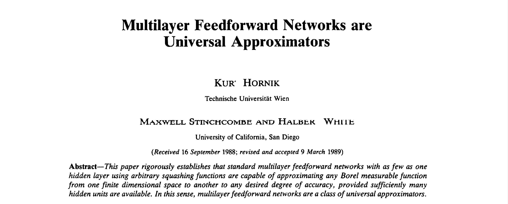
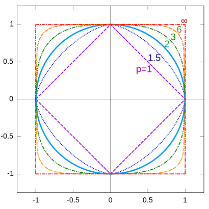
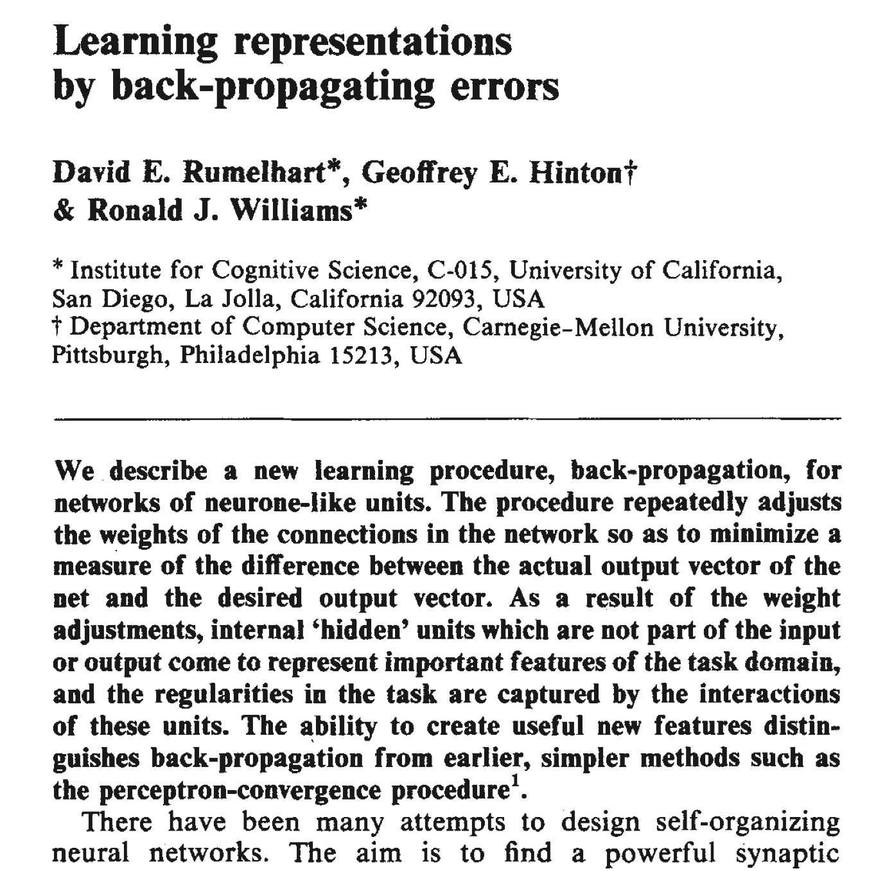

<!-- _class: invert -->
<!-- _paginate: false -->

# Matemática para redes neurais (backpropagation)

### Aprendizado por reforço para aplicações em redes neurais

### Prof. Hallison Paz

##### 9 de fevereiro de 2024

---

<!-- ## Redes Neurais são aproximadores universais -->

<!-- _footer: https://doi.org/10.1016/0893-6080(89)90020-8 -->

---

<!-- _class: invert -->
<!-- _paginate: false -->

# Como você faria para um perceptron aproximar uma reta específica?

---
## Como se computa a saída de um MLP? 

---

# Composição de funções

<!-- _class: invert -->
<!-- _backgroundColor: #2D253F -->
<!-- _paginate: false -->

---

# Sabemos calcular a saída (resposta) de uma rede. E agora?

---

<!-- _class: invert -->
<!-- _backgroundColor: #2D253F -->

# Função de custo ou função de perda

---

# Métricas

##### Uma métrica ou função de distância é qualquer função que atende às 3 propriedades a seguir:

- Não negativa
- Simétrica
- Respeita desigualdade triangular

---

# Exemplos de Métricas

 

Distância na norma $L_p$:

$$d_{p}(x,y)=(\sum _{i=1}^{n}|x_{i}-y_{i}|^{p})^{\frac{1}{p}}$$

---

<!-- _paginate: false -->

# Temos uma medida do erro. E agora?

---

# Queremos minimizar o erro!

---

# Gradiente Descendente

  

$$\theta_{j+1} = \theta_j - \gamma \nabla C(\theta_j)$$

<!-- _footer: Para experimentar: https://www.geogebra.org/m/sWsGNs86 -->

---

# Funções de várias variáveis
 

#### Exemplo 1:

$$f: \mathbb{R}^2 \rightarrow \mathbb{R}, f(x, y) = x^2 + xy - cos(y)$$

 

#### Exemplo 2:

$$g: [0, \pi] \times [0, 2\pi] \rightarrow \mathbb{R}^3, g(x) = (sen(x)cos(y), sen(x)sen(y), cos(x)) $$

---

<!-- _class: invert -->
<!-- _backgroundColor: #2D253F -->

<!-- _paginate: false -->

# $\partial$ Derivadas Parciais 
# e o vetor $\nabla$ Gradiente 

---

# Regra da Cadeia

Se $h(x) = f(g(x))$, então:

 

$$\frac{dh}{dx} = \frac{df}{dg} \cdot \frac{dg}{dx}$$

<!--  -->

---
# Backpropagation

<!-- _footer: https://www.nature.com/articles/323533a0 -->

---

# Deu pra entender que a **função de ativação** tem um papel nesse processo?

---

<!-- _class: invert -->
<!-- _backgroundColor: #2d253f-->
<!-- _paginate: false -->

# Bibliografia complementar

- Goodfellow, Ian, Yoshua Bengio, and Aaron Courville. [Deep Learning](https://www.deeplearningbook.org/). Cambridge, MA: MIT Press, 2016. Chicago (author-date), 17th ed.
    - [Capítulo 4](https://www.deeplearningbook.org/contents/numerical.html) seção 4.3 (Gradient-Based Optimization)