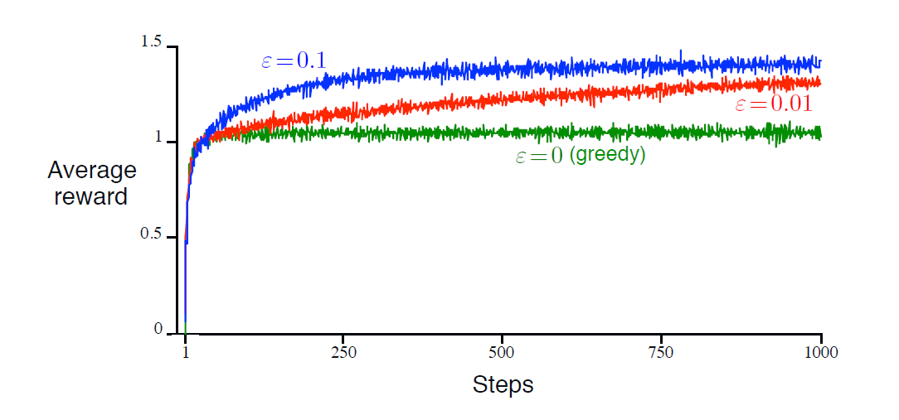

<!-- _class: invert -->
<!-- _paginate: false -->

# Multi-Armed Bandits

### Aprendizado por reforço para aplicações em redes neurais

### Prof. Hallison Paz

##### 15 de fevereiro de 2024

---

# Como definir o problema de multi-armed bandits?

---

# Proxy para...

---

# Investigação $\times$ Exploração
## (Exploration vs Exploitation)

---

# Faz sentido só investigar?

---

# lei dos grandes números

---

# Faz sentido só explorar?

---

## "SE EU TIVESSE 8 HORAS PARA CORTAR UMA ÁRVORE, GASTARIA SEIS AFIANDO MEU MACHADO"

 

-- Abraham Lincoln? Gimli, filho de Glóin? Desconhecido?

---

# Como solucionar razoavelmente o problema de multi-armed bandits?

---

# greedy vs $\epsilon$-greedy

## valor-ação

---

# greedy vs $\epsilon$-greedy

----

# greedy vs $\epsilon$-greedy

---

# Algoritmo

---

# Como fazer um algoritmo greedy investigar mais?

---

# Escolhas iniciais otimistas

---

# E se as distribuições não forem estacionárias?

---

# Cálculo do valor de uma ação

---

# Como se relaciona com aprendizado por reforço?

---

# Contextual Armed Bandits
## <<< Próxima semana >>>

---

# Troca de contexto

---

# Cartpole

<video width="480" height="320" controls>
  <source src="video/cartpole.mp4" type="video/mp4">
</video>

<!-- _footer: Cartpole no [OpenAI Gym](https://www.gymlibrary.dev/environments/classic_control/cart_pole/) -->

---

<!-- _class: invert -->
<!-- _backgroundColor: #2d253f-->
<!-- _paginate: false -->

# Bibliografia complementar

- Sutton, R.S. and Barto, A.G. (2018) [Reinforcement Learning: An Introduction](http://incompleteideas.net/book/the-book-2nd.html). 2nd Edition, A Bradford Book, Cambridge. **Capítulo 2**.

##### Para ir mais além

- A. G. Barto, R. S. Sutton and C. W. Anderson, ["Neuronlike adaptive elements that can solve difficult learning control problems,"](http://incompleteideas.net/papers/barto-sutton-anderson-83.pdf) in IEEE Transactions on Systems, Man, and Cybernetics, vol. SMC-13, no. 5, pp. 834-846, Sept.-Oct. 1983, doi: 10.1109/TSMC.1983.6313077.