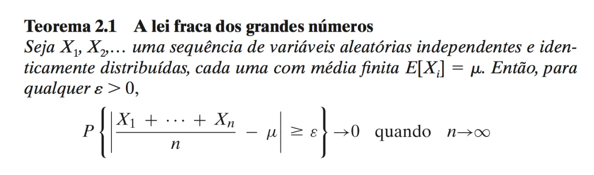
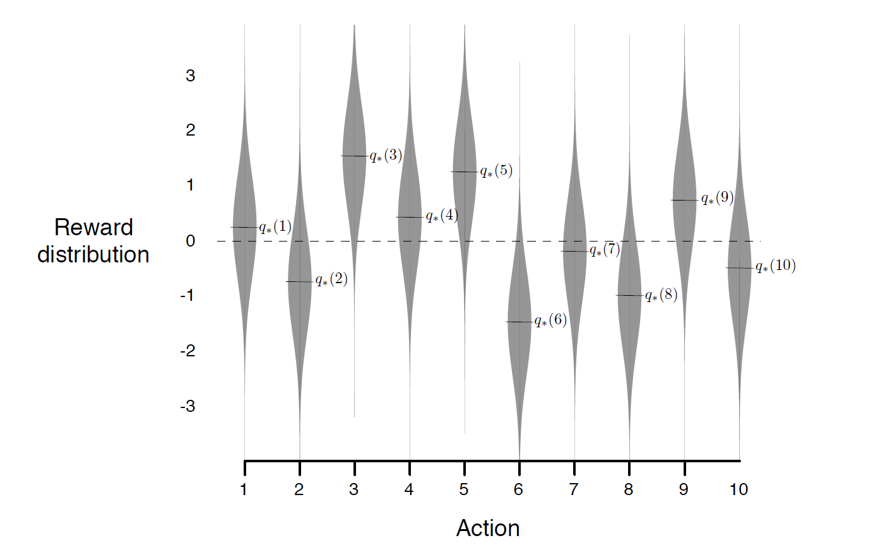
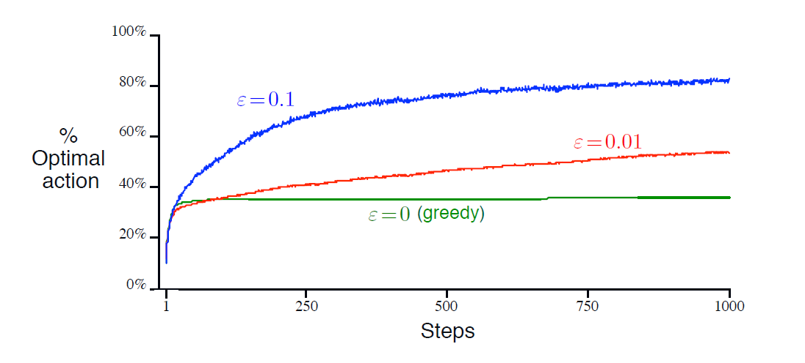

<!-- _class: invert -->
<!-- _paginate: false -->

# Multi-Armed Bandits

### Aprendizado por reforço para aplicações em redes neurais

### Prof. Hallison Paz

##### 15 de fevereiro de 2024

---

<!-- _class: invert -->
<!-- _paginate: false -->
# Choros e lamentações

---

<!-- _class: invert -->
<!-- _paginate: false -->

# Como definir o problema de multi-armed bandits?

---

# Que tipos de problemas seguem esta modelagem?

---

<!-- _class: invert -->
<!-- _backgroundColor: #2D253F -->

<!-- _paginate: false -->

# Investigação $\times$ Exploração

## (Exploration vs Exploitation)

---

# Faz sentido só investigar?

---

# Lei dos grandes n√∫meros

<!-- _footer: ROSS, S. [Probabilidade um curso moderno com aplicações](https://integrada.minhabiblioteca.com.br/books/9788577806881). 8. ed. Porto Alegre: Bookman, 2010. Capítulo 8. -->

---

# Faz sentido só explorar?

---

<!-- _class: invert -->

## "SE EU TIVESSE 8 HORAS PARA CORTAR UMA ÁRVORE, GASTARIA SEIS AFIANDO MEU MACHADO"

 

-- Abraham Lincoln? Gimli, filho de Glóin? Desconhecido?

---

<!-- _class: invert -->
<!-- _backgroundColor: #2D253F -->

# Como solucionar razoavelmente o problema de multi-armed bandits?

<!-- _paginate: false -->

---

# Métodos que avaliam ações
### (action-value methods)

- Valor de uma ação: $q_*(a) = \mathbb{E}[R_t | A_t=a]$

- Estimativa do valor: $Q_t(a) = ???$

## Que ação tomar?

---

# Greedy vs $\epsilon$-greedy

## Ação escolhida com base no valor

- $A_t = \text{argmax}_aQ_t(a)$, $1 - \epsilon$ "parte do tempo"
- Aleatória $\epsilon$ parte do tempo

---

# Exemplo: 
# 10-armed testbed

$$f(x)={\frac {1}{\sigma {\sqrt {2\pi }}}}\;\;\mathrm {e} ^{-{\frac {1}{2}}\left({\frac {x-\mu }{\sigma }}\right)^{2}} $$

---

# Greedy vs $\epsilon$-greedy

<!-- _footer: Sutton, R.S. and Barto, A.G. (2018) Reinforcement Learning: An Introduction. 2nd Edition, A Bradford Book, Cambridge. Capítulo 2  -->

----

# Greedy vs $\epsilon$-greedy

<!-- _footer: Sutton, R.S. and Barto, A.G. (2018) Reinforcement Learning: An Introduction. 2nd Edition, A Bradford Book, Cambridge. Capítulo 2  -->

---

# Algoritmo

<!-- _footer: Sutton, R.S. and Barto, A.G. (2018) Reinforcement Learning: An Introduction. 2nd Edition, A Bradford Book, Cambridge. Capítulo 2  -->

---

<!-- _class: invert -->
<!-- _backgroundColor: #2D253F -->
<!-- _paginate: false -->

# Como fazer um algoritmo greedy investigar mais?

---

# Escolhas iniciais otimistas

---

# E se as distribuições não forem estacionárias?

---

# Cálculo do valor de uma ação

 

$$Q_{n+1} = Q_n + \alpha[R_n - Q_n]$$

 

Quando $\alpha_n(a) = \frac{1}{n}$ para todo $n$, temos o caso anterior (média simples).

 

##### Qualquer sequência $\{\alpha_n(a)\}$ pode ser utilizada para solucionar o problema?

---

<!-- _backgroundColor: #2D253F -->
<!-- _class: invert -->

# Como se relaciona com aprendizado por reforço?

---

# Contextual Armed Bandits
## <<< Próxima semana >>>

---

# TROCA DE CONTEXTO ü•Å

---

# Problema do Cartpole

<video width="480" height="320" controls>
  <source src="video/cartpole.mp4" type="video/mp4">
</video>

<!-- _footer: Cartpole no [OpenAI Gym](https://www.gymlibrary.dev/environments/classic_control/cart_pole/) -->

---

<!-- _class: invert -->
<!-- _backgroundColor: #2d253f-->
<!-- _paginate: false -->

# Bibliografia complementar

- Sutton, R.S. and Barto, A.G. (2018) [Reinforcement Learning: An Introduction](http://incompleteideas.net/book/the-book-2nd.html). 2nd Edition, A Bradford Book, Cambridge. **Capítulo 2**.

##### Para ir mais além

- A. G. Barto, R. S. Sutton and C. W. Anderson, ["Neuronlike adaptive elements that can solve difficult learning control problems,"](http://incompleteideas.net/papers/barto-sutton-anderson-83.pdf) in IEEE Transactions on Systems, Man, and Cybernetics, vol. SMC-13, no. 5, pp. 834-846, Sept.-Oct. 1983, doi: 10.1109/TSMC.1983.6313077.