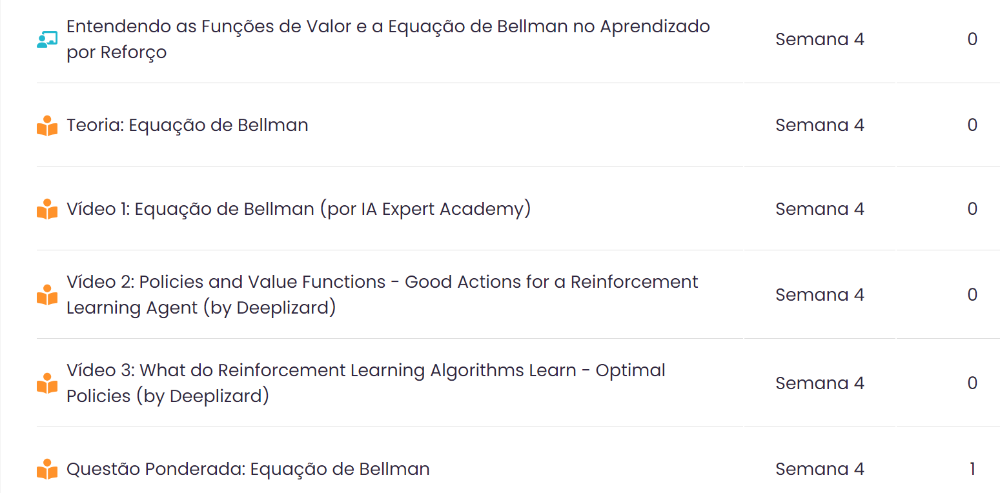
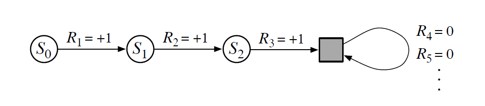
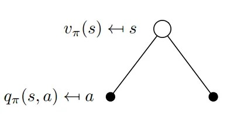
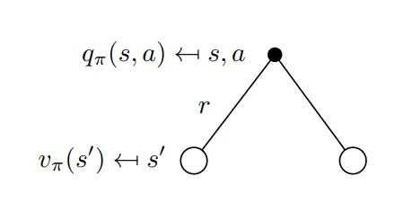
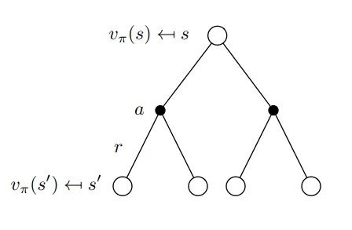
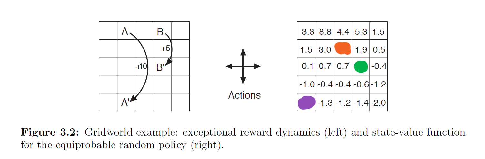
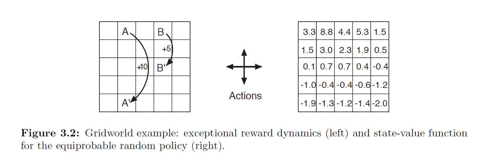
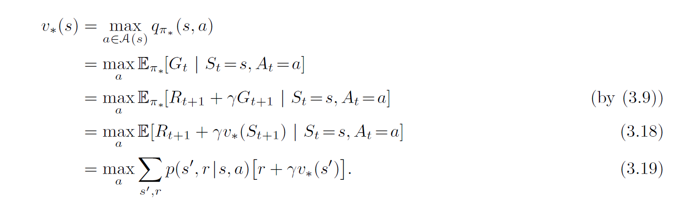
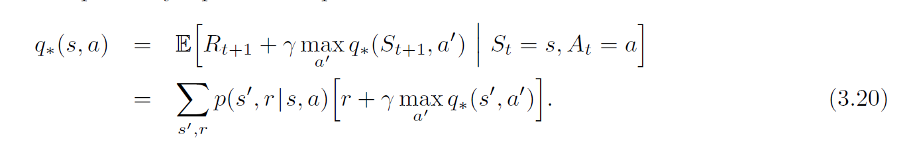
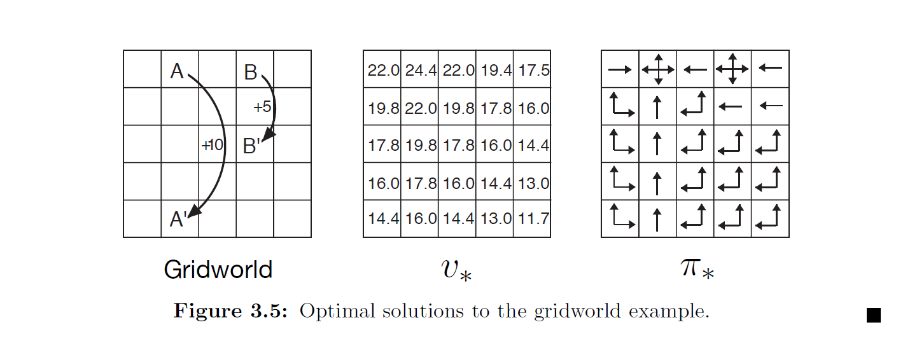

<!-- _class: invert -->
<!-- _paginate: false -->

# Funções de Valor e a Equação de Bellman

### Aprendizado por reforço para aplicações em redes neurais

### Prof. Hallison Paz

##### 27 de fevereiro de 2024

---

<!-- _class: invert -->
<!-- _paginate: false -->
# Dúvidas e Dívidas

<!-- ---

<!-- _paginate: false -->
 -->

---

### Reflexão
# Os juros do conhecimento

---
<!-- _paginate: false -->
#### Autoestudos na AdaLove

---

<!-- _class: invert -->
<!-- _backgroundColor: #2d253f-->
<!-- _paginate: false -->
# Funções de Valor

---

# Retorno, objetivo

$$G_t = R_{t+1} + \gamma R_{t+2} + \gamma^2R_{t+3} + ... = \sum_{k=0}^\infty \gamma^kR_{t+k+1}$$

---

# Estado Final

 

---

## Política como distribuição de probabilidade

 

Uma política é um mapeamento (função) que diz qual a probabilidade de escolher a ação $A_t=a$ no estado $S_t=s$.

 

$$\pi(a | s) = P[A_t=a | S_t=s]$$

---

# Exercício: especificação de uma política

---
## Função de valor de um estado $s$ sob a política $\pi$

 

$v_\pi(s) = \mathbb{E}_\pi[G_t | S_t = s] = \mathbb{E}_\pi[\sum\limits_{k=0}^\infty \gamma^kR_{t+k+1} | S_t = s]$, para todo $s \in S$

---

## Função de valor de uma ação sob a política $\pi$

 

$q_\pi(s, a) = \mathbb{E}_\pi[G_t | S_t=s, A_t = a] = \mathbb{E}_\pi[\sum\limits_{k=0}^\infty \gamma^kR_{t+k+1} | S_t=s, A_t=a]$

---

## Derivando a equação de Bellman

<!-- _footer: Fonte: https://stats.stackexchange.com/questions/243384/deriving-bellmans-equation-in-reinforcement-learning -->

---

## A equação de Bellman

 

$v_\pi(s) = \mathbb{E}_\pi[G_t | S_t=s] = \sum\limits_{a \in A}\pi(a|s)\sum\limits_{s′\in \mathcal{S}}\sum\limits_{r \in \mathcal{R}}p(s′,r | a, s)[r + \gamma v\pi(s′)]$

---

<!-- _class: invert -->
<!-- _backgroundColor: #2d253f-->
<!-- _paginate: false -->
## Entendendo a ~~cabulosa💀~~ equação de Bellman

---
# "Backup Diagram"

#### Foco no estado

 

* $v_\pi(s) = \sum\limits_{a \in \mathcal{A}}\pi(a | s)q_\pi(s, a)$

---

# "Backup Diagram"

#### Foco na ação

* $q_\pi(s, a) = r(s, a, s') + \sum\limits_{s' \in \mathcal{S}}p(s' | s, a) v_\pi(s')$

---

# Tudo junto...

$$v_\pi(s) = \sum\limits_{a \in \mathcal{A}}\pi(a | s)(r(s, a, s') + \gamma\sum\limits_{s' \in \mathcal{S}}p(s' | a, s)v_\pi(s'))$$

---

## Exercício: Qual o valor de cada estado colorido?

- Considere: $\gamma=0.9$; $r_A=10$; $r_B=5$; $r_{fora}=-1$; $r_{outros}=0$.
- $\pi(a | s) = \frac{1}{4}, \forall a \in \mathcal{A}$

---
# Resposta
<!--  -->

<!-- _foote: EXEMPLO: Sutton, 2018 -->

---
<!-- _class: invert -->
<!-- _backgroundColor: #2d253f-->
<!-- _paginate: false -->
# Políticas ótimas

---

# Políticas ótimas

 

- $\pi \gt \pi' \leftrightarrow v_\pi(s) \ge v_{\pi'}(s)$  para todo $s \in \mathcal{S}$

- A cada política ótima há uma função de valor de estado $v_*(s)$ e uma função de valor de ação ótimos $q_*(s, a)$.

---

Se a recompensa for determinística, tem-se:
$$v_*(s) = \max\limits_a r(s, a, s') + \gamma\sum\limits_{s' \in \mathcal{S}}p(s' | a, s)v_*(s')$$

<!-- _footer: Sutton, 2018 -->

---

No caso de recompensa determinística:
$$q_*(s, a) = r(s, a, s') + \gamma\sum\limits_{s' \in \mathcal{S}}p(s' | a, s)\max\limits_aq_*(s', a')$$

<!-- _footer: Sutton, 2018 -->

---

<!-- _footer: Sutton, 2018 -->

---

## Exercício: calcule o valor ótimo no grid do autoestudo

<!-- _paginate: false -->
---

# E quando não dá pra calcular o valor diretamente?

---
<!-- _class: invert -->
<!-- _backgroundColor: #2d253f-->
<!-- _paginate: false -->

# Bibliografia complementar

- Sutton, R.S. and Barto, A.G. (2018) [Reinforcement Learning: An Introduction](http://incompleteideas.net/book/the-book-2nd.html). 2nd Edition, A Bradford Book, Cambridge. **Capítulo 3** seções 3.4 a 3.6.

- Aleksandar Haber. [Clear Explanation of the Value Function and Its Bellman Equation](https://aleksandarhaber.com/deconstructing-the-meaning-of-the-value-function-and-its-bellman-equation-reinforcement-learning-tutorial/) – Reinforcement Learning Tutorial.

- Luc Gendrot. Not Another RL Tutorial! [Part 2: Chains, Rewards, and Decision Processes, Oh My!](https://medium.com/@lgendrot/teaching-myself-rl-eef155ef5e4a)