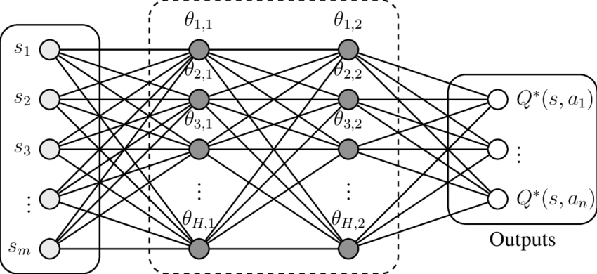
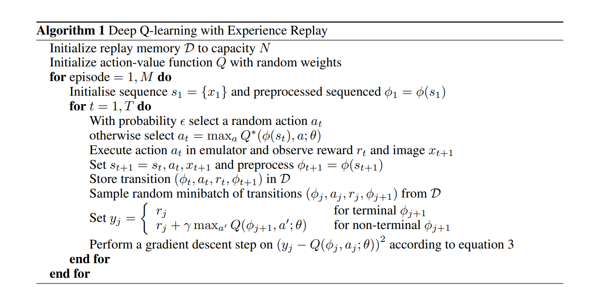
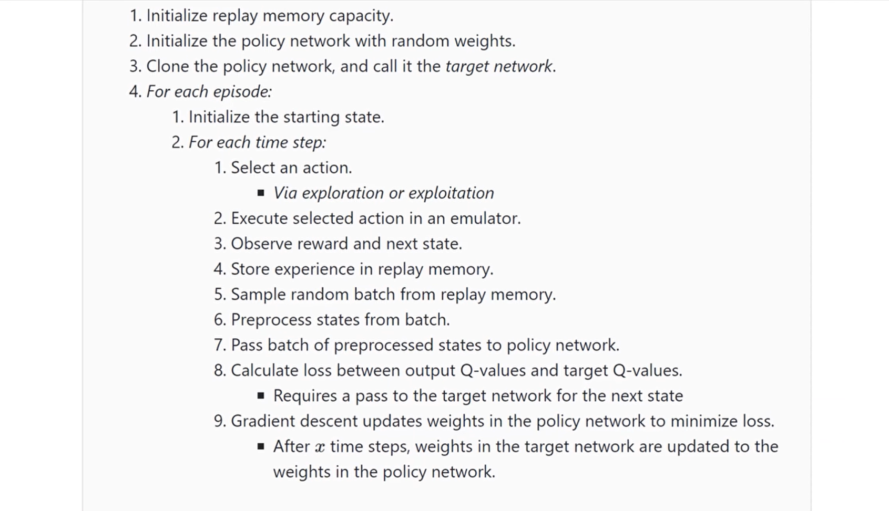

<!-- _class: invert -->
<!-- _paginate: false -->

# Deep Q Networks

### Aprendizado por reforço para aplicações em redes neurais

### Prof. Hallison Paz

##### 2 de abril de 2024

---

<!-- _class: invert -->
<!-- _paginate: false -->

# Dúvidas e Dívidas

 

---

# Deep Q Network

 

---

# Q-learning

 

$$Q^{\text{novo}}(s_k, a_k) =  Q^{\text{velho}}(s_k, a_k) + \alpha[R_{k+1} + \gamma\max\limits_a Q(s_{k+1}, a) - Q^{\text{velho}}(s_k, a_k)]$$

---

<!-- _class: invert -->
<!-- _backgroundColor: #2d253f-->
<!-- _paginate: false -->

# Melhorias?

---

---

<!-- _class: invert -->
<!-- _backgroundColor: #2d253f-->
<!-- _paginate: false -->

# Melhorias?

---

<!-- _footer: Fonte: https://youtu.be/xVkPh9E9GfE?feature=shared -->

---

<!-- _class: invert -->
<!-- _backgroundColor: #2d253f-->
<!-- _paginate: false -->

# Bibliografia complementar

- Paper: [Playing Atari with Deep Reinforcement Learning](https://arxiv.org/abs/1312.5602)

- Vídeo: [Replay Memory Explained - Experience for Deep Q-Network Training](https://youtu.be/Bcuj2fTH4_4?feature=shared)