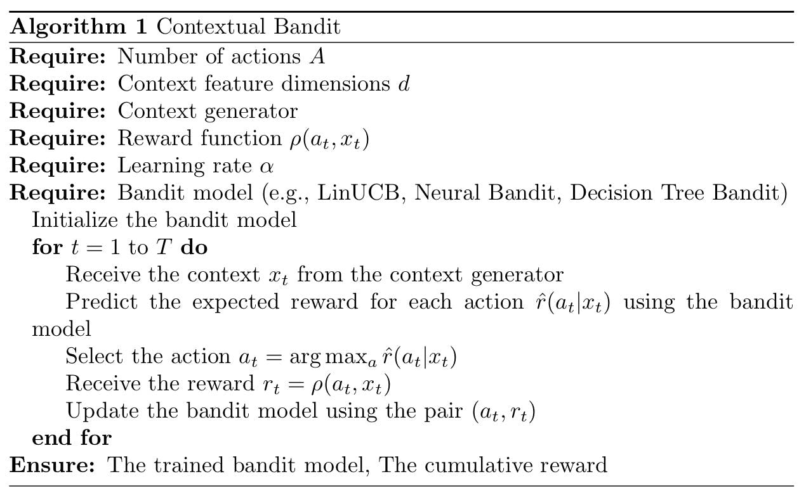
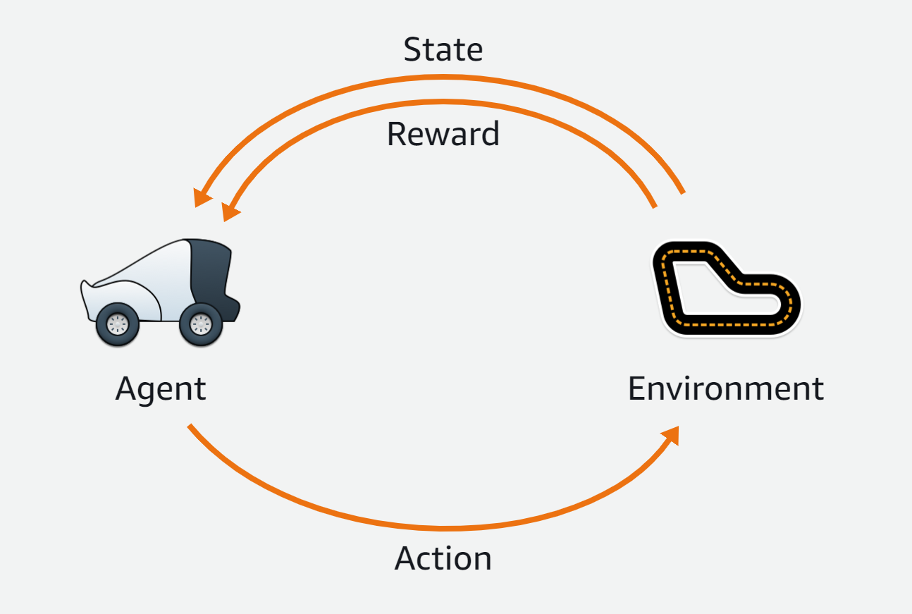
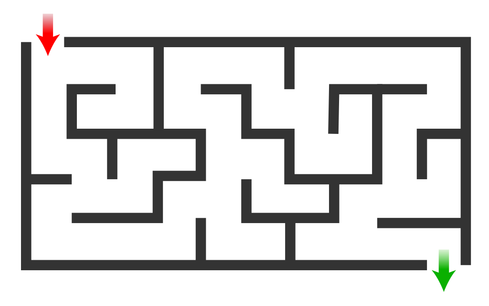

<style>
    section {
        font-family: "Manrope", Arial;
    }
    h1, h2 {
        font-family: "Space Mono", monospace;
    }
</style>


<!-- _class: invert -->
<!-- _paginate: false -->

# Aprendizado por Reforço com Deep Racer

### Aprendizado por reforço para aplicações em redes neurais

### Prof. Hallison Paz

##### 20 de fevereiro de 2024


---
<!-- _class: invert -->
<!-- _paginate: false -->
# Dúvidas e Dívidas

---

<!-- _class: invert -->
<!-- _paginate: false -->
# From bandits to "bandits cars"


---

<!-- _backgroundColor: #2D253F -->
<!-- _class: invert -->
<!-- _paginate: false -->

### Retomando...
# Multi-Armed Bands com distribuição não-estacionária

---

# Cálculo do valor de uma ação

<br/>

$$Q_{n+1} = Q_n + \alpha[R_n - Q_n]$$

<br/>

Quando $\alpha_n(a) = \frac{1}{n}$ para todo $n$, temos o caso anterior (média simples).

<br/>

##### Qualquer sequência $\{\alpha_n(a)\}$ pode ser utilizada para solucionar o problema?

---

<!-- _backgroundColor: #2D253F -->
<!-- _class: invert -->
<!-- _paginate: false -->
# Contextual Armed Bandits

---


<!-- _footer: Fonte: https://cloud.google.com/blog/products/ai-machine-learning/how-to-build-better-contextual-bandits-machine-learning-models -->
---



<!-- _footer: Fonte: [Hackernoon](https://hackernoon.com/contextual-multi-armed-bandit-problems-in-reinforcement-learning) -->
---

# Como se relaciona com aprendizado por reforço?

---
<style scoped>
h1 {
  /* text-align: center; */
  color: #ffffff
}
</style>

# Deep Racer


---

<!-- _paginate: false -->
<!-- _backgroundColor: #2D253F -->
<!-- _class: invert -->


# O que é aprendizado por reforço?

---

# Agente | Ambiente


---

# Estado | Ação



---

# Recompensa, Função de
### Retorno e objetivo

$$G_t = R_{t+1} + \gamma R_{t+2} + \gamma^2R_{t+3} + ... = \sum_{k=0}^\infty \gamma^kR_{t+k+1}$$


---

## Como modelar o problema de sair do labirinto?



---

## Mais um exemplo...

<iframe width="560" height="315" src="https://www.youtube.com/embed/20EjkNPf124?si=5AO31xYg3Fp50SWG" title="YouTube video player" frameborder="0" allow="accelerometer; autoplay; clipboard-write; encrypted-media; gyroscope; picture-in-picture; web-share" allowfullscreen></iframe>

---

# Função de recompensa no Deep Racer

Position on track
Heading
Waypoints
Track width
Distance from center line
All wheels on track
Speed
Steering angle

<!-- _footer: Documentação do [Deep Racer](https://docs.aws.amazon.com/deepracer/latest/developerguide/deepracer-console-train-evaluate-models.html#deepracer-reward-function-signature) -->

---

# Exemplo:

```python
def reward_function(params):
    '''
    Example of rewarding the agent to follow center line
    '''

    # Read input parameters
    track_width = params['track_width']
    distance_from_center = params['distance_from_center']
    # Calculate 3 markers that are at varying distances away from the center line
    marker_1 = 0.1 * track_width
    marker_2 = 0.25 * track_width
    marker_3 = 0.5 * track_width
    # Give higher reward if the car is closer to center line and vice versa
    if distance_from_center <= marker_1:
        reward = 1.0
    elif distance_from_center <= marker_2:
        reward = 0.5
    elif distance_from_center <= marker_3:
        reward = 0.1
    else:
        reward = 1e-3  # likely crashed/ close to off track

    return float(reward)
```

---

# Parâmetros e Hiperparâmetros


---

# Competição


- Competição individual por aluno. 
- Inscrições a partir de 5 de março.
- Haverá 3 workshops virtuais.
- Corrida virtual classificatória.
- 5 modelos selecionados por região geográfica
- 25 finalistas no Congresso da SBC em Brasília.


---

<!-- _class: invert -->
<!-- _backgroundColor: #2d253f-->
<!-- _paginate: false -->

# Bibliografia complementar

- Sutton, R.S. and Barto, A.G. (2018) [Reinforcement Learning: An Introduction](http://incompleteideas.net/book/the-book-2nd.html). 2nd Edition, A Bradford Book, Cambridge. **Capítulo 3** até a seção 3.3.

#### Para ir mais além

- J. Schulman, F. Wolski, P. Dhariwal, A. Radford, and O. Klimov, [Proximal policy optimization algorithms](https://arxiv.org/abs/1707.06347), arXiv.org, arXiv:1707.06347 [cs.LG].
    - Post de [apresentação de resultados](https://openai.com/research/openai-baselines-ppo).