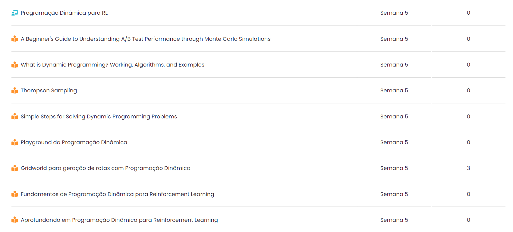
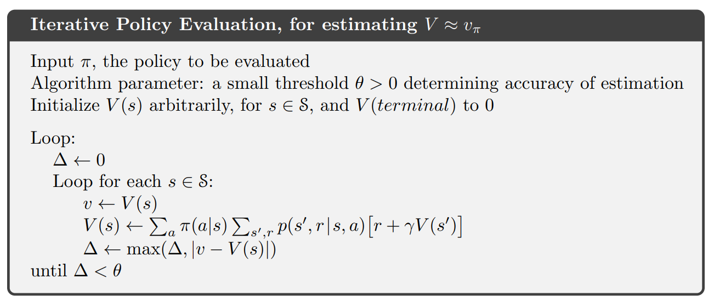
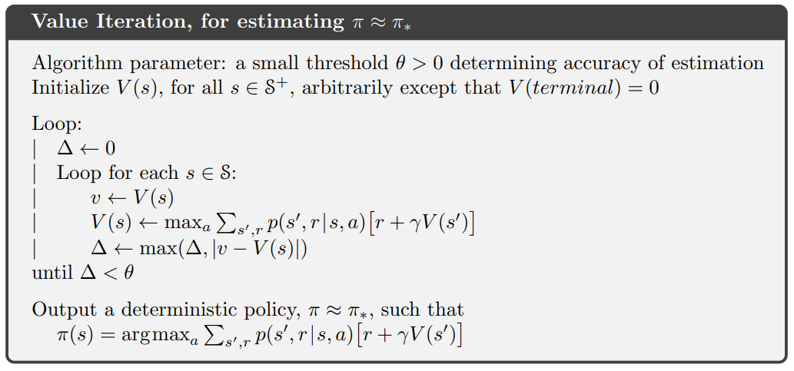
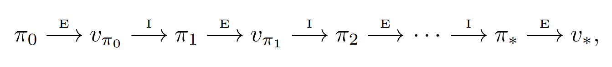
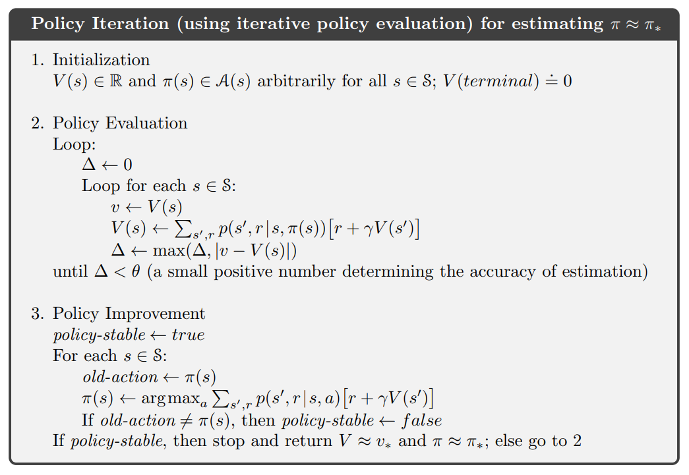

<!-- _class: invert -->
<!-- _paginate: false -->

# Programação Dinâmica para Aprendizado por Reforço

### Aprendizado por reforço para aplicações em redes neurais

### Prof. Hallison Paz

##### 5 de março de 2024

---

<!-- _class: invert -->
<!-- _paginate: false -->
# Dúvidas e Dívidas

 

- Ponderada sobre deep racer: a ser entregue na próxima sprint.
- Correção da ponderada de função de ativação.
- 1ª Prova.

<!-- ---

<!-- _paginate: false -->
 -->

<!-- ---

### Reflexão
# Os juros do conhecimento -->

---
<!-- _paginate: false -->
#### Autoestudos na AdaLove

----

# Equação de Bellman

 

$$v_\pi(s) = \mathbb{E}_\pi[G_t | S_t=s] = \sum\limits_{a \in A}\pi(a|s)\sum\limits_{s′\in \mathcal{S}}\sum\limits_{r \in \mathcal{R}}p(s′,r | a, s)[r + \gamma v\pi(s′)]$$

  

$$v_\pi(s)  = \sum\limits_{a \in A}\pi(a|s)\sum\limits_{s′, r}p(s′,r | a, s)[r + \gamma v\pi(s′)]$$

 

* Sistema de $|S|$ equações! 😱

---

# Iterative Policy Evaluation

 

$$v_{k+1}(s) = \mathbb{E}_\pi[R_{t+1} + \gamma v_k(S_{t+1}) | S_t=s] = \sum\limits_{a \in A}\pi(a|s)\sum\limits_{s′, r}p(s′,r | a, s)[r + \gamma v_{k}(s′)]$$

* expected updates

---

## Iterative Policy Evaluation

---

<!-- _class: invert -->
<!-- _backgroundColor: #2d253f-->
<!-- _paginate: false -->

# Gridworld

---

<!-- _class: invert -->
<!-- _backgroundColor: #2d253f-->
<!-- _paginate: false -->

# Melhorando uma política

---

# Iteração de Valor

##### Busca a política ótima por:

$$v_{*}(s) = \max\limits_a q_{\pi_*}(s, a)$$
$$v_{*}(s) = \max\limits_a\sum\limits_{s′, r}p(s′,r | a, s)[r + \gamma v_{*}(s′)]$$

 

$$v_{k+1}(s) = \max\limits_a\sum\limits_{s′, r}p(s′,r | a, s)[r + \gamma v_{k}(s′)]$$

---

## Iteração de Valor

---

# Teorema da melhoria de Política

 

Sejam $\pi$ e $\pi'$ duas políticas tais que

$$v_{\pi'}(s) \geq v_{\pi}(s) \text{ para todo } s \in S - \{s_c\}$$

e

$$q_{\pi'}(s_c) \ge v_{\pi}(s_c)$$

então $\pi' \ge \pi$.

<!-- _footer: Adaptado de ([Sutton](http://www.incompleteideas.net/book/RLbook2020.pdf), 2018) -->

---

# Melhorando uma Política

 

Construa $\pi'$ de modo que:

$$\pi' = \arg\max\limits_a q_{\pi}(s, a)$$

 

* Pelo teorema da melhoria, $\pi'$ tem que ser pelo menos tão boa quanto $\pi$

---

# Iteração de Política

<!-- _footer: Esquema de ([Sutton](http://www.incompleteideas.net/book/RLbook2020.pdf), 2018) -->

---

## Iteração de Política

<!-- ---

# E quando não dá pra calcular o valor diretamente? -->

---
<!-- _class: invert -->
<!-- _backgroundColor: #2d253f-->
<!-- _paginate: false -->

# Bibliografia complementar

-  Bellman, Richard. “[The theory of Dynamic Programming](https://www.rand.org/content/dam/rand/pubs/papers/2008/P550.pdf)” Bulletin of the American Mathematical Society 60 (1954): 503-515.

- ▶️ Steve Brunton. Model Based Reinforcement Learning: [Policy Iteration, Value Iteration, and Dynamic Programming](https://youtu.be/sJIFUTITfBc?si=iCHZYo4KV9C007OU). 