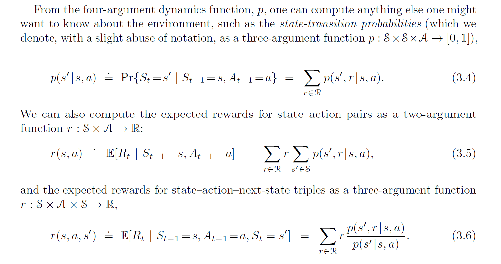

<!-- _class: invert -->
<!-- _paginate: false -->

# Processos de Decisão de Markov

### Aprendizado por reforço para aplicações em redes neurais

### Prof. Hallison Paz

##### 23 de fevereiro de 2024

---

<!-- _class: invert -->
<!-- _paginate: false -->
# Dúvidas e Dívidas

<!-- ---

<!-- _paginate: false -->
 -->

---

<!-- _class: invert -->
<!-- _backgroundColor: #2d253f-->
<!-- _paginate: false -->
# Problemas de Decisão Sequencial

---

---

<!-- _backgroundColor: #F2F2F2 -->
<!-- _paginate: false -->

---

---
<!-- _class: invert -->
<!-- _backgroundColor: #2d253f-->
<!-- _paginate: false -->

# Processos de Decisão de Markov (MDP)

----

# Processos de Decisão de Markov (MDP)

### Notação

- Tempo $t$
- Estados $S_t \in \mathcal{S}$
- Ações $A_t \in \mathcal{A}(s)$
- Recompensas $R_{t+1} \in \mathcal{R} \subset \mathbb{R}$ 

#### Sequência ou trajetória
 

$$S_0,A_0,R_1, S_1,A_1,R_2, S_2,A_2,R_3, . . .$$

---

*Se as variáveis aleatórias $R_t$ e $S_t$ tiverem distribuições de probabilidade discretas bem definidas e que dependem apenas do estado e ação anteriores, então tem-se um **Processo de Decisão de Markov**.*

<!-- _footer: Adaptado de (Sutton, 2018) -->

---

# Os exemplos que vimos no começo da aula são MDPs?

---

## Dinâmica de um processo de decisão de Markov

 

$p(s', r|s, a) = Pr\{S_t=s',R_t=r | S_{t−1}=s,A_{t−1}=a\}$

 

$\sum_\limits{s' \in \mathcal{S}}\sum\limits_{r \in \mathcal{R}}p(s', r|s, a) = ???$ para todo $s \in \mathcal{S}, a \in \mathcal{A}(s)$

<!-- _footer: Quanto vale o somatório? -->

---

<!-- _footer: Sutton, 2018 -->

---

# Retorno, objetivo

$$G_t = R_{t+1} + \gamma R_{t+2} + \gamma^2R_{t+3} + ... = \sum_{k=0}^\infty \gamma^kR_{t+k+1}$$

---
<!-- _class: invert -->
<!-- _backgroundColor: #2d253f-->
<!-- _paginate: false -->
# Políticas e funções de valor

---
<!-- _class: invert -->
<!-- _backgroundColor: #2d253f-->
<!-- _paginate: false -->
# Bibliografia complementar

- Sutton, R.S. and Barto, A.G. (2018) [Reinforcement Learning: An Introduction](http://incompleteideas.net/book/the-book-2nd.html). 2nd Edition, A Bradford Book, Cambridge. **Capítulo 3** até a seção 3.4.

#### Para ir além

- Warren B. Powell. [Reinforcement Learning and Stochastic Optimization. A unified framework for sequential decisions](https://castle.princeton.edu/RLSO/). Wiley, New Jersey, 2022.
    - [Capítulo 1](https://castle.princeton.edu/wp-content/uploads/2021/09/RLSO-Cover-Chapter1-Sept32021.pdf) até a seção 1.4

