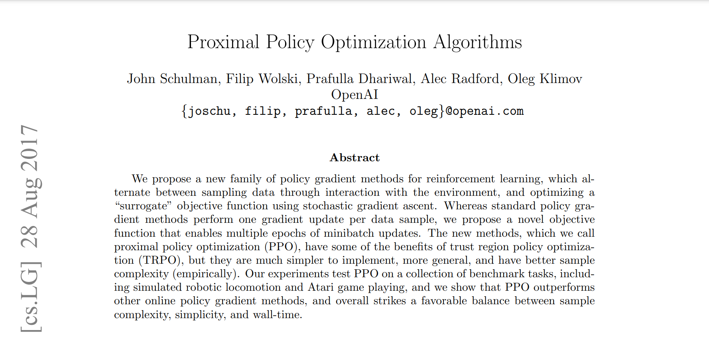

<!-- _class: invert -->
<!-- _paginate: false -->

# Proximal Policy Optimization

### Aprendizado por reforço para aplicações em redes neurais

### Prof. Hallison Paz

##### 22 de março de 2024

---

<!-- _class: invert -->
<!-- _paginate: false -->

# Dúvidas e Dívidas

 

- Ponderada de Deep Racer: 24/03/2024
- Ponderada de Lunar Lander: $\ge$ 31/03/2024

---

<!-- _paginate: false -->

# Pesquisa

<!-- _footer: Clique no [LINK DA PESQUISA](https://forms.gle/9LBrjDG7oKAQojEs9) -->

---

# Discussão nos grupos

* Quais as ideias centrais de um método do tipo "Policy Gradient"?
* O que é um método ator-crítico e como ele funciona?
* Qual a motivação para método Proximal Policy Optimization (PPO)? 
    * Como ele difere de outros métodos que estudamos com redes neurais?

---

# Proximal Policy Optimization

<!-- _footer: [LINK PARA MAIS INFORMAÇÕES](https://openai.com/research/openai-baselines-ppo) -->

---

# Prática

<!-- _footer: código no [Google Colab](https://github.com/hallpaz/drl/tree/main/notebooks) -->

---

<!-- _class: invert -->
<!-- _backgroundColor: #2d253f-->
<!-- _paginate: false -->

# Bibliografia complementar

- [Proximal Policy Optimization Algorithms](https://arxiv.org/abs/1707.06347) (paper)

- [Spinning Up - PPO](https://spinningup.openai.com/en/latest/algorithms/ppo.html)

- [Spinning Up - DDPG](https://spinningup.openai.com/en/latest/algorithms/ddpg.html)

- [Spinning Up - TRPO](https://spinningup.openai.com/en/latest/algorithms/trpo.html#background)

- [PPO with Tensorflow 2.X](https://towardsdatascience.com/proximal-policy-optimization-ppo-with-tensorflow-2-x-89c9430ecc26)

- [PPO for Trading using Tensorflow](https://medium.com/@sthanikamsanthosh1994/reinforcement-learning-part-8-proximal-policy-optimization-ppo-for-trading-9f1c3431f27d)