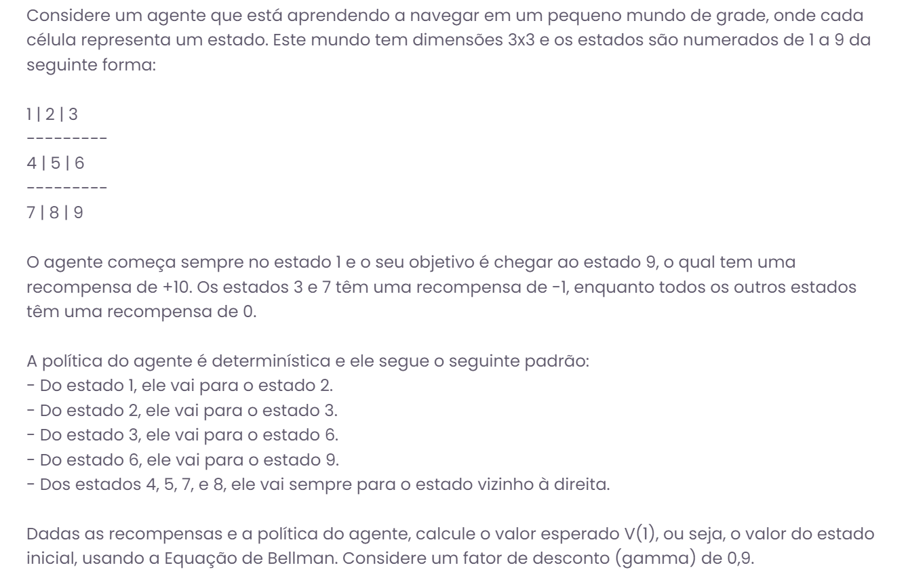
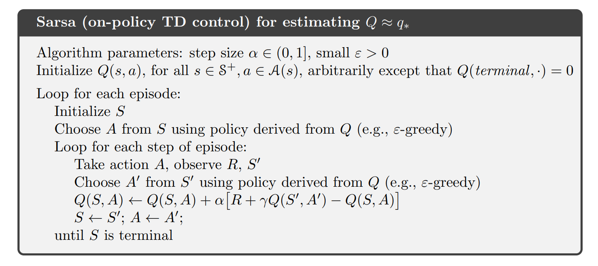
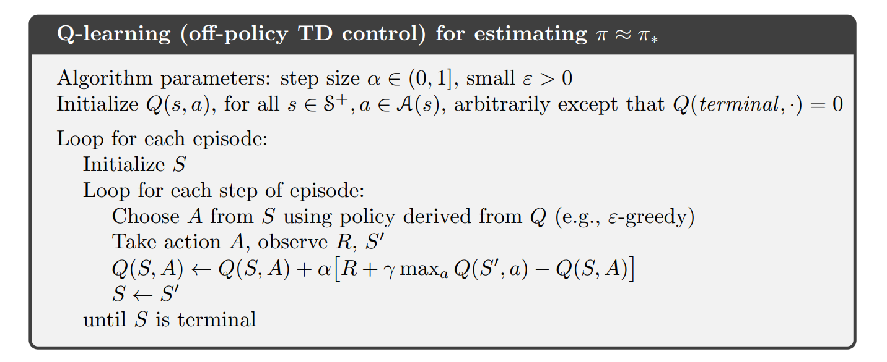
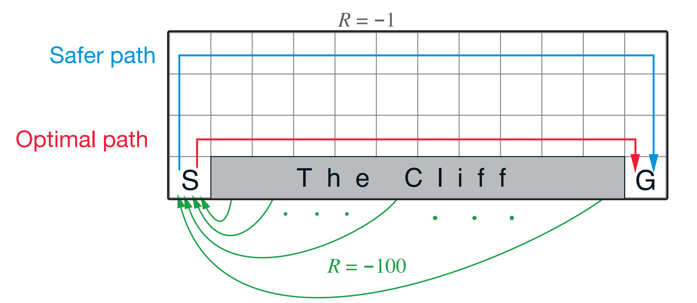

<!-- _class: invert -->
<!-- _paginate: false -->

# Q-Learning e Aprendizagem por Diferença Temporal

### Aprendizado por reforço para aplicações em redes neurais

### Prof. Hallison Paz

##### 8 de março de 2024

---

<!-- _class: invert -->
<!-- _paginate: false -->
# Dúvidas e Dívidas

 

- Ponderada sobre deep racer: olhar mensagem do prof Raphael no Slack.
- Prazo da ponderada Gridworld: 11/03/2024?? 

---

### Ponderada Eq de Bellman

---

<!-- _class: invert -->
<!-- _paginate: false -->

# Artefatos desta Sprint

---

<!-- _class: invert -->
<!-- _backgroundColor: #2d253f-->
<!-- _paginate: false -->

# SARSA: State-Action-Reward-State-Action

---

# SARSA: State-Action-Reward-State-Action

 

$$Q^{\text{novo}}(s_k, a_k) =  Q^{\text{velho}}(s_k, a_k) + \alpha[R_{k+1} + \gamma Q(s_{k+1}, a_{k+1}) - Q^{\text{velho}}(s_k, a_k)]$$

 

- Algoritmo *on-policy*
- Funciona com TD(n)

<!-- SARSA - on-policy - always doing what you think is the best think (more exploitation)

- more cumulative reward during learning process

you need to take trajections on the environment - aprender com experiência -->

---

## SARSA

---
<!-- _class: invert -->
<!-- _backgroundColor: #2d253f-->
<!-- _paginate: false -->

# Q-Learning

---

# Q-learning

 

$$Q^{\text{novo}}(s_k, a_k) =  Q^{\text{velho}}(s_k, a_k) + \alpha[R_{k+1} + \gamma\max\limits_a Q(s_{k+1}, a) - Q^{\text{velho}}(s_k, a_k)]$$

- Algoritmo *off-policy*

---

## Q-Learning

---

# SARSA vs Q-Learning

---

<!-- _class: invert -->
<!-- _paginate: false -->

# Onde entra redes neurais nisso tudo?

---

<!-- _class: invert -->
<!-- _paginate: false -->

# Intuição do Deep Q-Learning

---

<!-- _class: invert -->
<!-- _backgroundColor: #2d253f-->
<!-- _paginate: false -->

# Bibliografia complementar

- ▶️ Steve Brunton. Q-Learning: [Model Free Reinforcement Learning and Temporal Difference Learning](https://youtu.be/0iqz4tcKN58?si=curA0y49JN_Hlcn-).

- Volodymyr Mnih, Koray Kavukcuoglu, David Silver, Alex Graves, Ioannis Antonoglou, Daan Wierstra, Martin Riedmiller. [Playing Atari with Deep Reinforcement Learning](https://arxiv.org/abs/1312.5602). ArXiv preprint arXiv:1312.5602 (2013)
