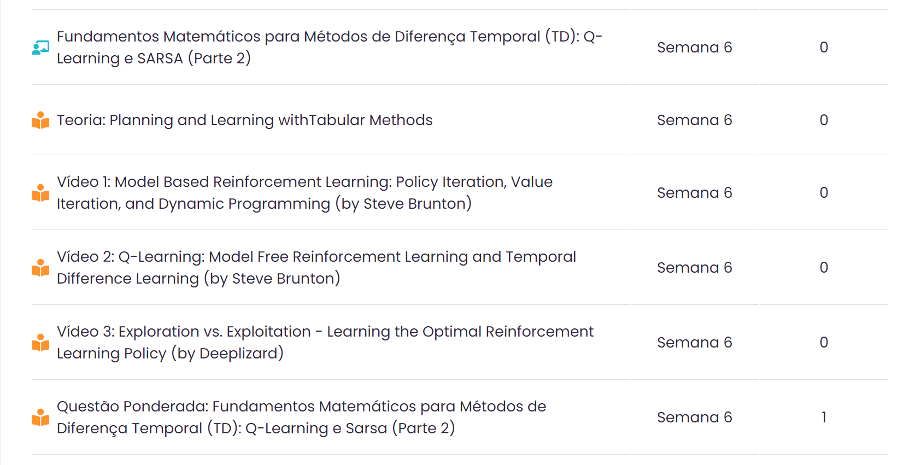

<!-- _class: invert -->
<!-- _paginate: false -->

# Fundamentos de Métodos de Diferença Temporal - parte 2

### Aprendizado por reforço para aplicações em redes neurais

### Prof. Hallison Paz

##### 12 de março de 2024

---

<!-- _class: invert -->
<!-- _paginate: false -->
# Dúvidas e Dívidas

 

- Ponderada sobre gridworld: entrega 12/03/2024 (hoje)!
- Ponderada "Fundamentos ... TD 1": entrega ??/03/2024.
- Correção das ponderadas de função de Markov e Bellman.
- 1ª Prova.

---

<!-- _class: invert -->
<!-- _paginate: false -->

# O custo do erro

---

<!-- _footer: Espaço em branco. -->

---
## Autoestudos na Adalove

---

## Ponderada da semana 5

---

# Dúvidas?

---

<!-- _class: invert -->
<!-- _backgroundColor: #2d253f-->
<!-- _paginate: false -->

# Bibliografia complementar

- Volodymyr Mnih, Koray Kavukcuoglu, David Silver, Alex Graves, Ioannis Antonoglou, Daan Wierstra, Martin Riedmiller. [Playing Atari with Deep Reinforcement Learning](https://arxiv.org/abs/1312.5602). ArXiv preprint arXiv:1312.5602 (2013)