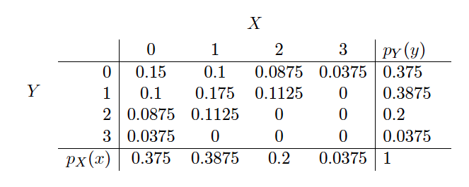

<!-- _class: invert -->
<!-- _paginate: false -->

# Introdução a decisões sequenciais

### Aprendizado por reforço para aplicações em redes neurais

### Prof. Hallison Paz

##### 21 de fevereiro de 2024

---

<!-- _paginate: false -->

# O que esperar da aula de hoje?

---
<!-- _paginate: false -->
# Análise do artefato da Sprint 2

---
<!-- _class: invert -->
<!-- _backgroundColor: #2d253f-->
<!-- _paginate: false -->
# Revisão de Probabilidade

---

# Revisão de Probabilidade

- Espaço Amostral
- Evento
- Probabilidade
- Variável aleatória

---

# Probabilidade Condicional

- eventos: $P(B\mid A)={\frac {P(B \cap A)}{P(A)}}$

- variáveis: $P(x\mid y)={\frac {P(X = x, Y=y)}{P(y)}}$ 

---

# Eventos Independentes

∀$x \in \mathcal{X}$, $y \in \mathcal{Y}$, $p(x = x, y = y) = p(x = x)p(y = y)$.

---
<!-- _class: invert -->
<!-- _backgroundColor: #2d253f-->
<!-- _paginate: false -->
# Variável aleatória

---

# Variável aleatória

### Valor esperado

$$E[X] = \sum\limits_x xp(x)$$

 

$$E[X]=\int _{-\infty }^{\infty }xf(x)dx$$
---

# Variável aleatória

### Variância

$$Var(X) = E[(X - \mu)^2]$$

 

$$Var(X) = E[X^2] - E[X]^2$$

---

<!-- _class: invert -->
<!-- _backgroundColor: #2d253f-->
<!-- _paginate: false -->

# Exemplos de Distribuições Notáveis

---

# Distribuição Binomial ou de Bernouli

$p(1) = P[X = 1] = p$

$p(0) = P[X = 0] = 1 - p$

---

# Distribuição Normal

---

# Teorema do Limite Central

<!-- _footer: ROSS, S. [Probabilidade um curso moderno com aplicações](https://integrada.minhabiblioteca.com.br/books/9788577806881). 8. ed. Porto Alegre: Bookman, 2010. Capítulo 8. -->

---

# Distribuição Conjunta e Probabilidade marginal

<!-- _footer: Fonte: [MathExchange](https://math.stackexchange.com/questions/1497879/understanding-how-to-obtain-this-table-for-the-joint-probability) -->

---
<!-- _class: invert -->
<!-- _backgroundColor: #2d253f-->
<!-- _paginate: false -->
# Problemas de Decisão Sequencial

---

---
<!-- _class: invert -->
<!-- _backgroundColor: #2d253f-->
<!-- _paginate: false -->
# Bibliografia complementar

- Goodfellow, Ian, Yoshua Bengio, and Aaron Courville. [Deep Learning](https://www.deeplearningbook.org/). Cambridge, MA: MIT Press, 2016. Chicago (author-date), 17th ed.
    - [Capítulo 3](https://www.deeplearningbook.org/contents/prob.html) até a seção 3.9.3.

- ROSS, S. [Probabilidade um curso moderno com aplicações](https://integrada.minhabiblioteca.com.br/books/9788577806881). 8. ed. Porto Alegre: Bookman, 2010. 
    - *Revisar tópicos nos capítulos de 2 a 7, se necessário*
