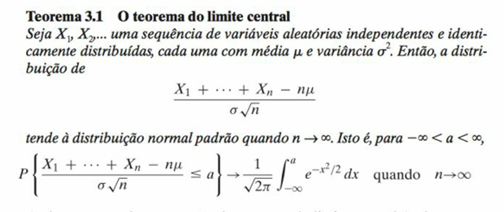
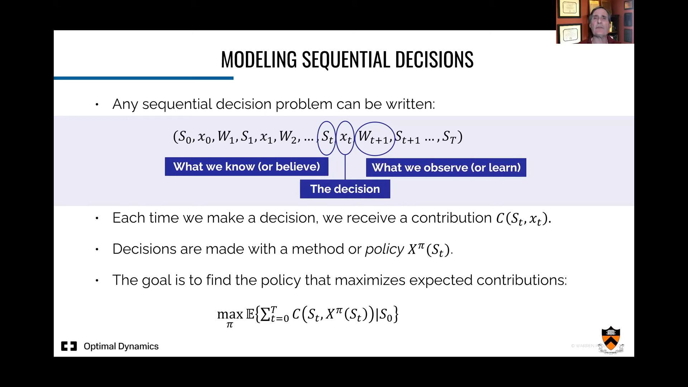
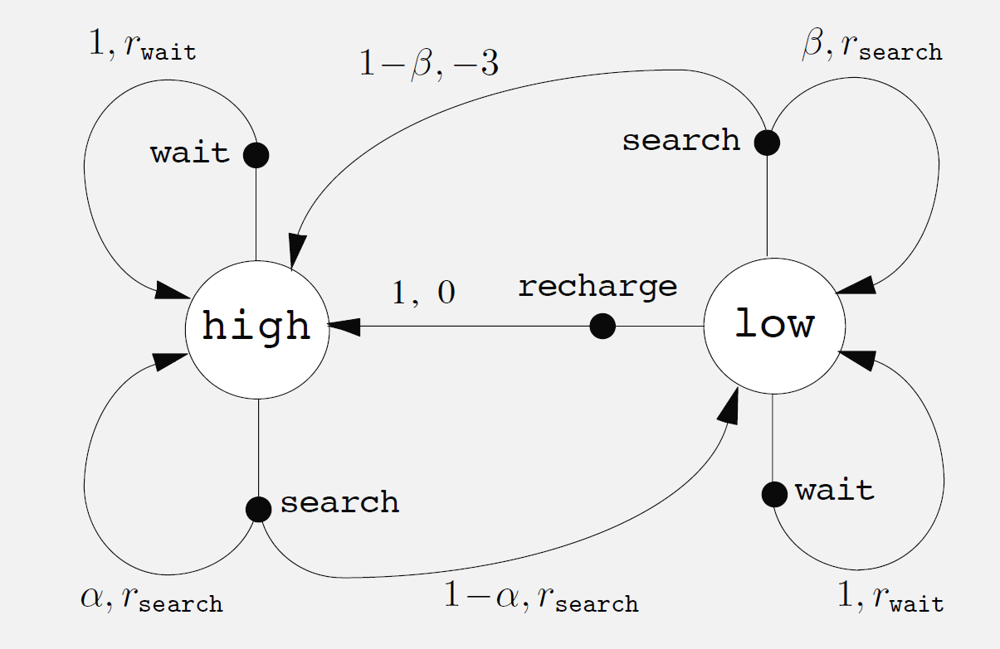
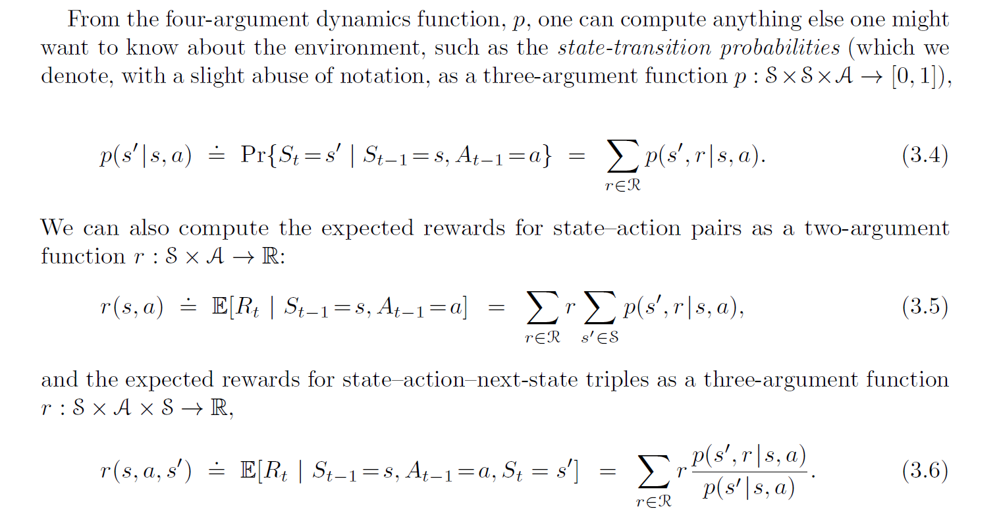

<!-- _class: invert -->
<!-- _paginate: false -->

# Introdução a decisões sequenciais

### Aprendizado por reforço para aplicações em redes neurais

### Prof. Hallison Paz

##### 21 de fevereiro de 2024

---
<!-- _class: invert -->
<!-- _paginate: false -->
# Dúvidas e Dívidas

---

# Distribuição de Probabilidade

---

# Probabilidade Condicional

---

# Valor esperado

$$E[X] = \sum xp(x)$$

 

$$E[X]=\int _{-\infty }^{\infty }xf(x)dx$$
---

# Variância

$$Var(X) = E[(X - \mu)^2]$$

$$Var(X) = E[X^2] - E[X]^2$$

---

# Distribuição Binomial ou de Bernouli

$$p(0) = P[X = 0] = 1 - p$$
$$p(0) = P[X = 1] = p$$

---

# Distribuição Normal

prova pagina 249

---

# Teorema do Limite Central

---

Binomial converge para normal

---

# Problemas de Decisão Sequencial

---

----
# Notação

- Tempo $t$
- Estados $S_t \in \mathcal{S}$
- Ações $A_t \in \mathcal{A}(s)$
- Recompensas $R_{t+1} \in \mathcal{R} \subset \mathbb{R}$ 

#### Sequência ou trajetória
 

$$S_0,A_0,R_1, S_1,A_1,R_2, S_2,A_2,R_3, . . .$$

---

If the random variables $R_t$ and $S_t$ have well defined discrete probability distributions dependent only on the preceding state and action, then we have a **Markov Decision Process**. *(adapted from [1])*

<!-- _footer: - [1] Sutton, 2018 -->

---

<!-- _backgroundColor: #F2F2F2 -->
<!-- _paginate: false -->

---

# Dinâmica de um processo de decisão de Markov

 

$p(s', r|s, a) = Pr\{S_t=s',R_t=r | S_{t−1}=s,A_{t−1}=a\}$

 

$\sum_\limits{s' \in \mathcal{S}}\sum\limits_{r \in \mathcal{R}}p(s', r|s, a)$ para todo $s \in \mathcal{S}, a \in \mathcal{A}(s)$

---

<!-- _footer: Sutton, 2018 -->

---

# Retorno, objetivo

$$G_t = R_{t+1} + \gamma R_{t+2} + \gamma^2R_{t+3} + ... = \sum_{k=0}^\infty \gamma^kR_{t+k+1}$$

---

# Políticas e funções de valor

---
<!-- _class: invert -->
<!-- _backgroundColor: #2d253f-->
<!-- _paginate: false -->
# Bibliografia complementar

- Sutton, R.S. and Barto, A.G. (2018) [Reinforcement Learning: An Introduction](http://incompleteideas.net/book/the-book-2nd.html). 2nd Edition, A Bradford Book, Cambridge. **Capítulo 3** até a seção 3.4.
