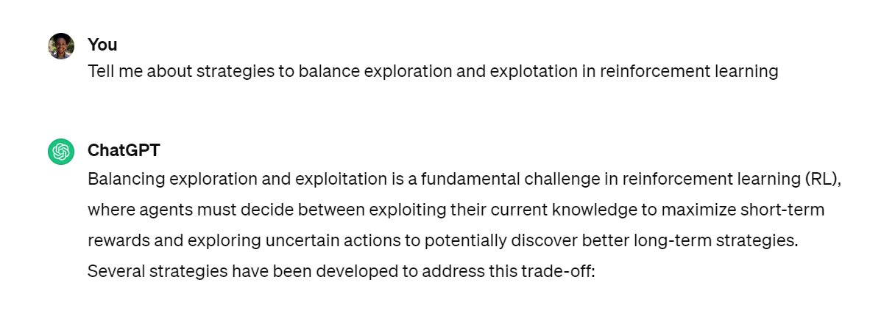

<!-- _class: invert -->
<!-- _paginate: false -->

# Exploration vs Explotation | Ajuste de Hiperparâmetros

### Aprendizado por reforço para aplicações em redes neurais

### Prof. Hallison Paz

##### 27 de março de 2024

---

<!-- _class: invert -->
<!-- _paginate: false -->

# Dúvidas e Dívidas

 

- Ponderada de Deep Racer: entregar todo o material na AdaLove.
    - Imagens: link de Google Drive, Github etc.
    - AdaLove, não Slack.
- Ponderada de [Lunar Lander](https://gymnasium.farama.org/): *quantos dias?*
- Ponderada do [Car Racing usando PPO](https://gymnasium.farama.org/environments/box2d/car_racing/): *quantos dias?*

---

<!-- _class: invert -->
<!-- _backgroundColor: #2d253f-->
<!-- _paginate: false -->

# Exploration vs Exploitation

---

## Exploration vs Exploitation

<!-- _footer: Veja a [conversa aqui](https://chat.openai.com/share/8e10c6d0-8700-4f6d-b34e-9e439253a457) -->

---

<!-- _class: invert -->
<!-- _backgroundColor: #2d253f-->
<!-- _paginate: false -->

# Ajuste de Hiperparâmetros

---

<!-- _footer: intencionalmente em branco -->

---

<!-- _class: invert -->
<!-- _backgroundColor: #2d253f-->
<!-- _paginate: false -->

# Bibliografia complementar

- [Lunar Lander](https://gymnasium.farama.org/environments/box2d/lunar_lander/)
- [Car racing](https://gymnasium.farama.org/environments/box2d/car_racing/)

