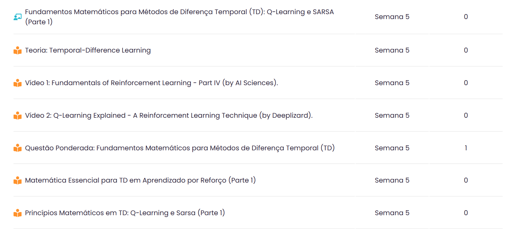

<!-- _class: invert -->
<!-- _paginate: false -->

# Fundamentos de Métodos de Diferença Temporal

### Aprendizado por reforço para aplicações em redes neurais

### Prof. Hallison Paz

##### 7 de março de 2024

---

<!-- _class: invert -->
<!-- _paginate: false -->
# Dúvidas e Dívidas

 

- Ponderada sobre deep racer: a ser entregue na próxima sprint.
- Correção da ponderada de função de ativação.
- Correção do Cartpole.

<!-- ---

<!-- _paginate: false -->
 -->

<!-- ---

### Reflexão
# Os juros do conhecimento -->

---
<!-- _paginate: false -->
#### Autoestudos na AdaLove

----

# Função de Qualidade

Função de valor estado-ação

 

$$Q(s, a) = \mathbb{E}[r(s', s, a) + \gamma v(s')]$$
 

$$Q(s, a) = \sum\limits_{s'}p(s' | s, a)(r(s', s, a) + \gamma v(s'))$$

 

* Assume que tem um **modelo** da recompensa e da transição

---

# Função de Qualidade

 

###### Calcula-se a função de valor de estado:
 

$$v(s) = \max\limits_a Q(s, a)$$

###### Constrói-se uma política:
 

$$\pi(s, a) = \arg\max\limits_a Q(s, a)$$

---

## \<RECAP\> Iteração de Valor

##### Busca a política ótima por:

$$v_{*}(s) = \max\limits_a q_{\pi_*}(s, a)$$
$$v_{*}(s) = \max\limits_a\sum\limits_{s′, r}p(s′,r | a, s)[r + \gamma v_{*}(s′)]$$

 

$$v_{k+1}(s) = \max\limits_a\sum\limits_{s′, r}p(s′,r | a, s)[r + \gamma v_{k}(s′)]$$

---

<!-- _class: invert -->
<!-- _paginate: false -->

# O que fazer se não tiver um modelo?

---

<!-- _class: invert -->
<!-- _backgroundColor: #2d253f-->
<!-- _paginate: false -->

# Aprendizado por Monte Carlo

---

# Aprendizado por Monte Carlo

$$G_t = R_{t+1} + \gamma R_{t+2} + \gamma^2R_{t+3} + ... = \sum_{k=0}^\infty \gamma^kR_{t+k+1}$$

###### Retorno de um episódio:

$$G = \sum_{k=0}^n \gamma^kR_{k+1}$$

###### Roda a política, calcula o retorno, divide pelos estados:

$v_{i+1}(s) = v_i(s) + \frac{1}{n}(G - v_{i}(s))$ , para todos os estados no episódio.

---

# Aprendizado por Monte Carlo

 

$$v_{i+1}(s) = v_i(s) + \frac{1}{n}(G - v_{i}(s))$$

$$Q_{i+1}(s, a) = Q_i(s, a) + \frac{1}{n}(G - Q_{i}(s, a))$$

 

* Diferença é uma "medida de erro"
* Aprendizado por experiência; sem modelo prévio.

---
<!-- _class: invert -->
#### Legal, mas....

# Monte Carlo Learning é ineficiente.

## POR QUÊ?

---

<!-- _class: invert -->
<!-- _backgroundColor: #2d253f-->
<!-- _paginate: false -->

# Aprendizado por Diferença Temporal

<!-- maybe events that happened more recently are somehow related to the rewards im getting -->

---

# Diferença Temporal (TD)

 

$$v(s_k) = \mathbb{E}[R_{k+1} + \gamma v(s_{k+1})]$$

###### Expressão para TD(0):

 

$$v^{\text{novo}}(s_k) = v^{\text{velho}}(s_k) + \alpha[R_{k+1} + \gamma v^{\text{velho}}(s_{k+1}) - v^{\text{velho}}(s_k)]$$

###### Expressão para TD(1): **???????**

* No limite, converge para o aprendizado por Monte Carlo.

<!-- ---

TD-$\lambda$ -->

---

<!-- _class: invert -->
<!-- _backgroundColor: #2d253f-->
<!-- _paginate: false -->

# SARSA: State-Action-Reward-State-Action

---

# SARSA: State-Action-Reward-State-Action

 

$$Q^{\text{novo}}(s_k, a_k) =  Q^{\text{velho}}(s_k, a_k) + \alpha[R_{k+1} + \gamma Q(s_{k+1}, a_{k+1}) - Q^{\text{velho}}(s_k, a_k)]$$

 

* SARSA - on-policy
* funciona com TD(n)

<!-- SARSA - on-policy - always doing what you think is the best think (more exploitation)

- more cumulative reward during learning process

you need to take trajections on the environment - aprender com experiência -->

---
<!-- _class: invert -->
<!-- _backgroundColor: #2d253f-->
<!-- _paginate: false -->

# Q-Learning

---

# Q-learning - off-policy

 

$$Q^{\text{novo}}(s_k, a_k) =  Q^{\text{velho}}(s_k, a_k) + \alpha[R_{k+1} + \gamma\max\limits_a Q(s_{k+1}, a) - Q^{\text{velho}}(s_k, a_k)]$$

<!-- Q-learning pode aprender por imitação pq é off-policy

experience replay

can explore more 

epsilon-greedy - off-policy search strategies
-->

---
<!-- _class: invert -->
<!-- _backgroundColor: #2d253f-->
<!-- _paginate: false -->

# Bibliografia complementar

- ▶️ Ajay Halthor. [Foundation of Q-learning | Temporal Difference Learning explained!](https://youtu.be/uJX_72MnKg8?si=0y6R5tmPP0G-TUJD)

- ▶️ Steve Brunton. Q-Learning: [Model Free Reinforcement Learning and Temporal Difference Learning](https://youtu.be/0iqz4tcKN58?si=curA0y49JN_Hlcn-).