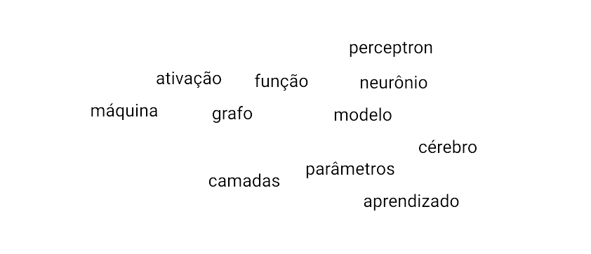
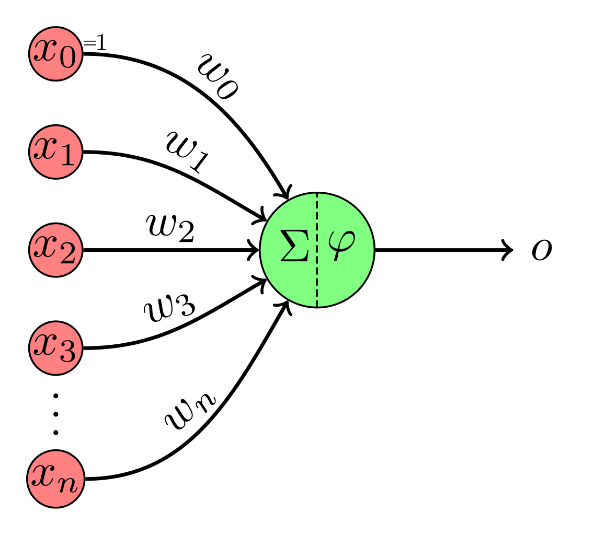
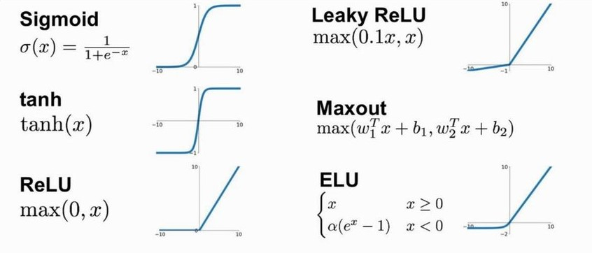

Hallison Paz

---

Turma

- inglês
- matemática

---

# Matemática para redes neurais (feedforward)

## Por quê?

---

# O que é uma rede neural?

---

---

# Como isso ajuda a resolver problemas?

---

# Forward Propagation

---

combinação, produto escalar, matrizes, linear, não-linear, entrada, saída

---

<!-- _footer: REPRESENTAÇÃO MATRICIAL.   Imagem: https://www.jeremyjordan.me/intro-to-neural-networks/-->

---

# Função de ativação

## Por quê?

---

# Função de ativação
#### Exemplos

<!-- _footer: Figure on ResearchGate. Available from: https://www.researchgate.net/figure/Fig-3-The-basic-activation-functions-of-the-neural-networksNeural-Networks_fig3_350567223 [accessed 7 Feb, 2024] -->
---

# O que não pode ser uma função de ativação?

---

# Perceptron Multicamadas
## Multilayer Perceptron (MLP)

<!-- _footer: John Salatas, CC BY-SA 3.0 <https://creativecommons.org/licenses/by-sa/3.0>, via Wikimedia Commons -->

---

composição de funções, multiplicação de matrizes, transformações lineares

---

# Questão Ponderada - parte 1

Você foi contratado por uma startup de tecnologia de saúde que está desenvolvendo um algoritmo de aprendizado profundo para detectar anomalias em imagens de raios-X. Durante a fase de prototipagem, a equipe decidiu usar a função de ativação ReLU nas camadas ocultas de sua rede neural.

Após algumas iterações, você observa que muitos neurônios na rede estão "morrendo" durante o treinamento, ou seja, eles estão sempre produzindo uma saída zero, independentemente da entrada.

----

# Questão Ponderada - parte 2

a) Explique por que a função ReLU pode causar o "morte" de neurônios durante o treinamento.
b) Sugira uma modificação ou alternativa à função ReLU para mitigar esse problema.
c) Descreva como essa modificação ou alternativa pode beneficiar o treinamento do modelo, especialmente em um contexto de detecção de anomalias em imagens médicas.

---

# Bibliografia complementar

- Goodfellow, Ian, Yoshua Bengio, and Aaron Courville. [Deep Learning](https://www.deeplearningbook.org/). Cambridge, MA: MIT Press, 2016. Chicago (author-date), 17th ed.
    - [Capítulo 6](https://www.deeplearningbook.org/contents/mlp.html).

